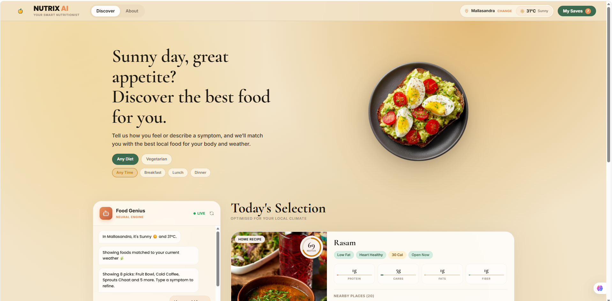
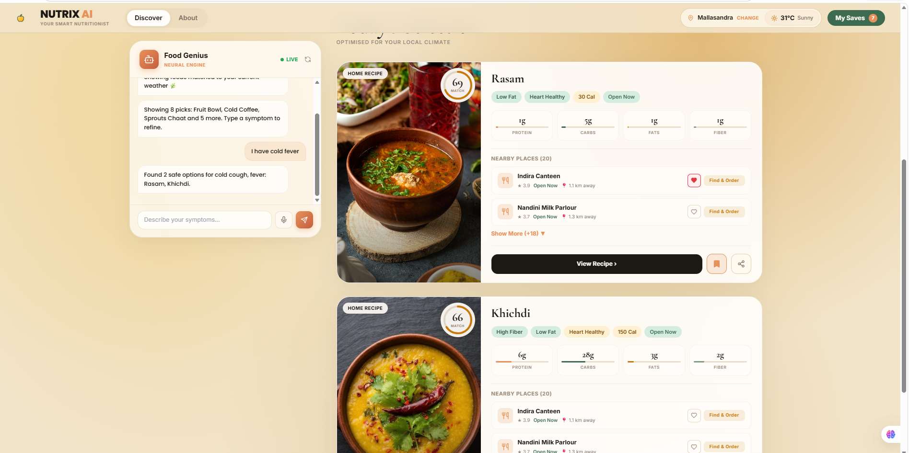
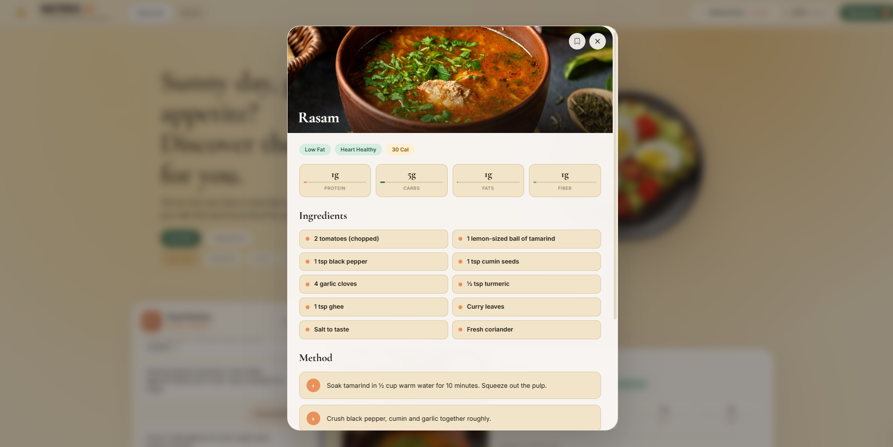
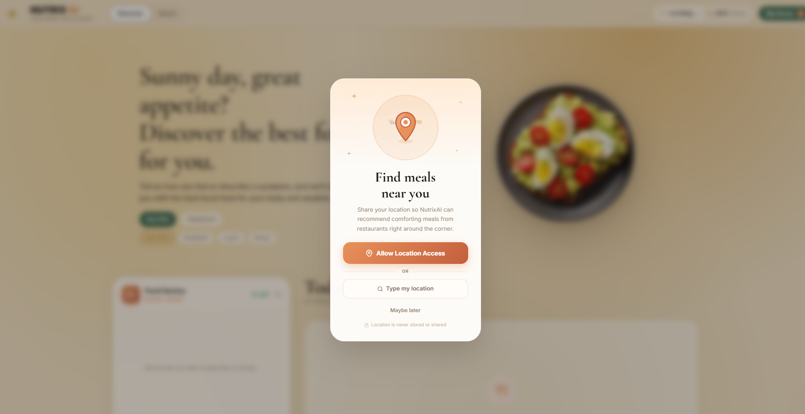
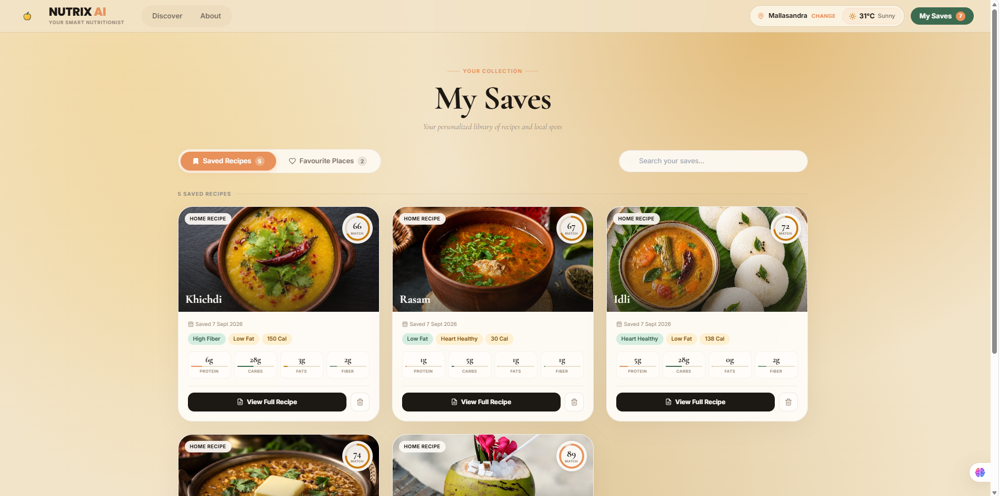
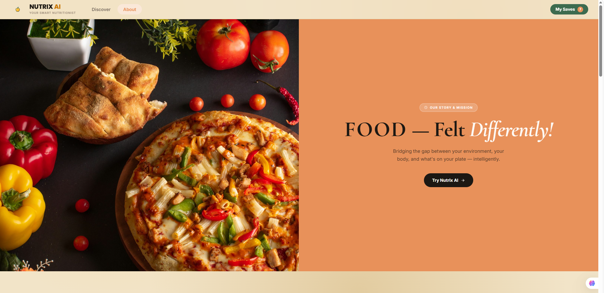

# Nutrix AI

Nutrix AI is a climate-intelligent food recommendation app. It combines real-time weather data with how you're feeling right now to recommend Indian dishes that actually fit the moment — then finds nearby restaurants that serve them.

## Demo

**Video walkthrough:** [Watch on Google Drive](https://drive.google.com/file/d/1GwpdfF16x5HhRBbCW3BDus6uPjueIz6z/view?usp=sharing)

| Discover | Chatbot in action |
|---|---|
|  |  |

| Recipe card | Location prompt |
|---|---|
|  |  |

| Saves | About |
|---|---|
|  |  |

## How it works

1. **Environmental context** — the app reads your location and pulls live weather (temperature, condition) for it.
2. **Understanding the message** — a rule-based keyword matcher (`backend/ai_logic.py`, with fuzzy matching for typos) classifies what you type into either:
   - a **health condition** such as fever, cold & cough or acid reflux (27 conditions in `backend/data/expanded_health_rules.json`, each with foods to prefer and avoid), or
   - an **intent**: a specific dish craving ("I want to eat pasta"), a spicy craving, food for travel, a question about medicine, or general browsing by weather.
3. **Choosing dishes** — candidate dishes come from the matching health rules or from a weather-to-food mapping (warming vs. cooling, hydrating, etc.). Each dish is scored on health fit (40%), weather fit (25%), discovery (30%) and variety (5%).
4. **Recommendations** — you get a feed of dishes with macros, a match score and recipes, plus nearby places that serve them: restaurants from a bundled menu dataset (`backend/data/restaurants.csv`) matched to your area, and places found through Geoapify.

### Where the LLMs are used

The chat itself does not depend on an LLM. Two LLMs (Groq's Llama 3.3 70B as primary, Google Gemini as fallback) are used for:

- **Unknown conditions** — if you mention a condition that isn't in the rules file, the LLM generates foods to prefer and avoid for it. These rules are saved to the rules file and reused.
- **Restaurant re-ranking** — checking which nearby restaurants are most likely to serve the recommended dish.

Without API keys, the app still runs on the keyword matcher and the existing rules.

## Health disclaimer

Nutrix AI is an academic project and **not medical advice**. Food suggestions for symptoms come from the rules in `backend/data/expanded_health_rules.json`, and for conditions outside that file, from LLM-generated rules that are **not reviewed by a medical professional**. When a message mentions medicine, the app shows a reminder to consult a doctor. Always seek professional advice for health concerns.

## Tech stack

- **Frontend:** React (Vite), Framer Motion, Lucide icons
- **Backend:** FastAPI (Python); keyword-based intent detection; Groq (Llama 3.3 70B) with Google Gemini as fallback for generating new health rules and re-ranking restaurants; Geoapify for location and places; WeatherAPI for live weather

## Project structure

```
NutrixAI/
├── frontend/                  # React + Vite app
│   ├── .env.example           # VITE_API_URL (backend address)
│   └── src/
│       ├── App.jsx
│       ├── components/
│       └── assets/images/     # Dish photos and landing-page images
├── backend/                   # FastAPI server
│   ├── app.py                 # API routes and recommendation pipeline
│   ├── ai_logic.py            # Keyword-based intent and condition detection
│   ├── gemini_service.py      # LLM calls (Groq primary, Gemini fallback)
│   ├── *_engine.py            # Weather, health, dish and nutrition logic
│   ├── data/                  # Health rules, nutrition table, restaurant menu dataset
│   ├── scripts/               # One-off maintenance scripts (not used by the running app)
│   └── .env.example           # API keys and settings
└── docs/screenshots/          # README images
```

## Running it locally

### Backend

```bash
cd backend
python -m venv venv
venv\Scripts\activate          # Windows
# source venv/bin/activate     # macOS/Linux
pip install -r requirements.txt
copy .env.example .env         # Windows — then fill in your API keys
# cp .env.example .env         # macOS/Linux
uvicorn app:app --reload --port 8000
```

### Frontend

```bash
cd frontend
npm install
npm run dev
```

The app runs at `http://localhost:5173` (frontend) and talks to `http://localhost:8000` (backend).

To point the frontend at a different backend (for example a deployed one), copy `frontend/.env.example` to `frontend/.env` and set `VITE_API_URL`.

### API keys you'll need

Copy `backend/.env.example` to `backend/.env` and fill in your own keys for:

- `GROQ_API_KEY` — primary LLM (Groq)
- `GOOGLE_API_KEY` — fallback LLM (Google Gemini)
- `GEOAPIFY_API_KEY` — location & restaurant data
- `WEATHERAPI_KEY` — live weather
- `UNSPLASH_ACCESS_KEY` — fallback images for dishes without a local photo

None of these are included in this repo — you'll need to sign up for your own free-tier keys.

`DEBUG=true` in `backend/.env` enables the `/debug/weather` and `/debug/location` endpoints for checking your keys. Keep it `false` when deploying.

## License

Academic project — built for coursework, not for commercial use.

Built by **Huda**, **Shruti**, and **Harshvardhan** (MSc. AI/ML).
